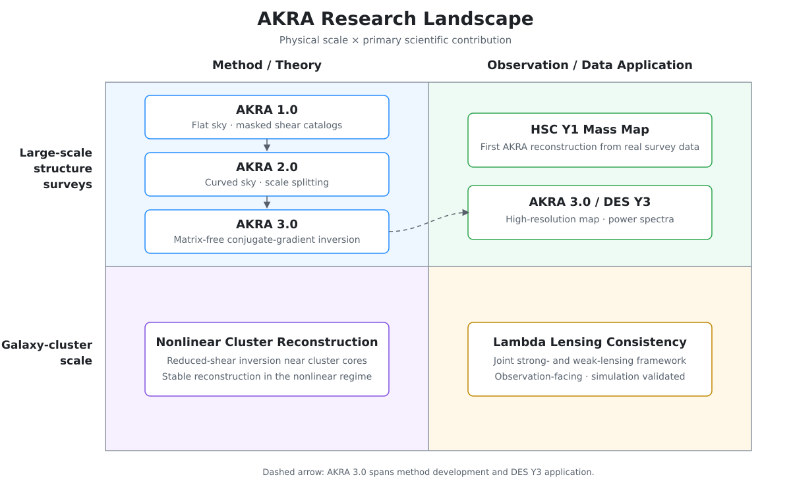

# AKRA Series

Accurate Kappa Reconstruction Algorithm (AKRA) is a collection of research tools for weak-lensing mass mapping on flat and curved skies. The repository includes the original explicit-matrix curved-sky implementation, a matrix-free conjugate-gradient prototype for AKRA 3.0, example notebooks, and DES Y3 simulation workflows.

> This is active research software. Interfaces, documentation, and numerical workflows may change as the project develops.
>
> This project is currently developed and maintained solely by me. The relevant documentation and instructions are still being prepared and will be updated gradually. If you encounter any issues or have suggestions, please feel free to contact me at: shiyuan0929@gmail.com
>
> A small confession: I enjoy building algorithms much more than writing comments! We are gradually organizing the AKRA code and user guides. The AKRA modules can also be embedded directly into your local research project and adapted to your existing workflow. Without AKRA 3.0's major leap in speed and efficiency, I might have retired AKRA 1.0 and 2.0 to the archive—they really are that slow to run. Fortunately, AKRA 3.0 gives the series a much faster future.
>
> Thank you for your interest and support!

## Highlights

- **Flat- and curved-sky reconstruction:** examples cover flat-field tests and full/partial-sky HEALPix maps.
- **Mask-aware harmonic treatment:** the curved-sky implementation keeps the real and imaginary spin-2 components required to retain E/B-mode information in the presence of a mask.
- **Matrix-free AKRA 3.0 prototype:** `core/akra_full_cg.py` applies the forward and adjoint operators through spherical-harmonic transforms and solves the regularized system with conjugate gradients, avoiding construction of the full coupling matrix.
- **DES Y3 workflows:** notebooks and MPI/PBS scripts support noiseless and noisy reconstruction experiments, batch realizations, and power-spectrum analysis.

## Repository layout

| Path | Description |
| --- | --- |
| `core/akra_full.py` | Curved-sky shear/convergence transforms and the explicit-matrix `KappaRec_sphere` solver. |
| `core/akra_full_cg.py` | Matrix-free coupling operator and `KappaRec_sphere_fast` conjugate-gradient solver. |
| `core/sphere_ks.py` | Spherical Kaiser-Squires utilities. |
| `utils/` | Map generation, power-spectrum, plotting, and HEALPix helper functions. |
| `akra_spere/test_akra_sphere.ipynb` | Curved-sky AKRA demonstration notebook. |
| `AKRA_HSC/test_akra.ipynb` | Flat-sky/HSC-style reconstruction demonstration. |
| `memory_refined.ipynb` | AKRA 3.0 memory and wall-time estimates. |
| `test_mask.ipynb` | Mask construction and validation experiments. |
| `desy3_sim/` | DES Y3 single-realization tests, batch simulations, power-spectrum analysis, PBS launchers, and comparison output. |

## Getting started

Clone the repository and create a Python environment:

```bash
git clone https://github.com/shiyuan-1/akra_series.git
cd akra_series
python -m venv .venv
source .venv/bin/activate
python -m pip install --upgrade pip
python -m pip install numpy scipy healpy matplotlib astropy tqdm h5py jupyter
```

Some notebooks and the DES Y3 workflow additionally use `pyccl`, `pandas`, `seaborn`, and `mpi4py`. Dependency versions are not yet pinned, so record the versions used for production analyses.

The repository is not packaged yet. Run from the repository root and add the source directories to `PYTHONPATH`:

```bash
export PYTHONPATH="$PWD/core:$PWD/utils${PYTHONPATH:+:$PYTHONPATH}"
```

### Matrix-free curved-sky reconstruction

Given HEALPix shear maps `gamma1` and `gamma2` and a survey `mask` with the same pixelization:

```python
import healpy as hp
from akra_full_cg import KappaRec_sphere_fast

nside = hp.get_nside(gamma1)
reconstructor = KappaRec_sphere_fast(
    gamma1,
    gamma2,
    mask=mask,
    nside_out=nside,
    lmax=2 * nside,
    neff=neff,          # optional effective-number-density map
)

kappa = reconstructor.sphere_AKRA(
    lam=1e-3,
    maxiter=150,
)
```

Set `neff=None` when no inverse-noise weighting is required. The regularization strength and convergence settings should be validated for each survey geometry and resolution.

## DES Y3 simulations

`desy3_sim/massmapping_100realizations_withNoise.py` distributes noisy realizations across MPI ranks and writes one HDF5 file per realization. The accompanying notebooks compare Kaiser-Squires and AKRA reconstructions and measure their power spectra.

These files currently contain site-specific paths and PBS resource requests. Before running them, update:

- `AKRA_DIR`, `SKYMAP_DIR`, and `DATA_FILE` in the Python workflow;
- the working directory, queue, nodes, and environment in the PBS scripts;
- the input and output directories in the analysis notebooks.

The DES Y3 input maps and generated HDF5 realizations are not included in this repository.

## Development snapshot

- **2025-11-26:** added the curved-sky demonstration notebook.
- **2025-12-30:** added the flat-sky/HSC reconstruction example.
- **2026-09-02:** added the AKRA 3.0 matrix-free solver, resource-estimate notebook, and DES Y3 simulation/analysis workflows.

## Roadmap

### High priority

- Complete the AKRA flat-sky and iterative reconstruction for nonlinear regimes (AKRA cluster) documentation.
- Establish a Discord channel and workflow for collaboration.
- Release and document the DES Y3 data products and scientific results.

### Medium priority

- Expand the curved-sky documentation. AKRA 2.0 already provides a comprehensive methodological description, and most collaborators can use their preferred AI-assisted workflows to configure and run AKRA 3.0 in different computing environments.

### Low priority

- Develop AKRA 3.0-like matrix-free inversion algorithms for other research areas, such as interferometry.

## Research landscape

These six works connect the development of AKRA 1.0, 2.0, and 3.0 with applications and extensions across large-scale surveys and galaxy-cluster scales.

[](docs/akra-research-landscape.svg)

The placement reflects each paper's primary emphasis. Some works span more than one quadrant: AKRA 3.0 develops a new inversion method and applies it to DES Y3, while the Lambda framework is designed for observational use but is currently demonstrated with simulations.

## Foundational AKRA citations

The complete list of AKRA-series and closely related papers is given below, including both published articles and preprints.

1. **Accurate Kappa Reconstruction Algorithm for Masked Shear Catalog (AKRA 1.0)**<br>
   Yuan Shi, Pengjie Zhang, Zeyang Sun, and Yihe Wang<br>
   *Physical Review D* **109**, 123530 (2024) · [Link](https://doi.org/10.1103/PhysRevD.109.123530)

2. **AKRA 2.0: Accurate Kappa Reconstruction Algorithm for Masked Shear Catalog**<br>
   Yuan Shi, Pengjie Zhang, Furen Deng, Shuren Zhou, Hongbo Cai, Ji Yao, and Zeyang Sun<br>
   *Journal of Cosmology and Astroparticle Physics* **2025** (07), 038 · [Link](https://doi.org/10.1088/1475-7516/2025/07/038)

3. **AKRA 3.0: A Matrix-Free Inversion Framework for Weak Lensing Mass Mapping and Its Application to DES Y3 Data**<br>
   Yuan Shi, Pengjie Zhang, Li Cui, Jian Qin, and Ji Yao<br>
   Preprint · [arXiv:2606.06175](https://arxiv.org/abs/2606.06175) · [PDF](https://arxiv.org/pdf/2606.06175.pdf)

4. **The First AKRA Mass Map Reconstruction from HSC Y1 Data**<br>
   Yuan Shi, Pengjie Zhang, Zhao Chen, Jian Qin, Li Cui, Furen Deng, and Ji Yao<br>
   *Journal of Cosmology and Astroparticle Physics* **2026** (02), 085 · [Link](https://doi.org/10.1088/1475-7516/2026/02/085)

5. **Nonlinear Weak Lensing Reconstruction for Galaxy Clusters**<br>
   Yuan Shi and Li Cui<br>
   *Physical Review D* **113**, 103514 (2026) · [Link](https://doi.org/10.1103/hn39-9hyy)

6. **Lambda as a Probe of Lensing Consistency**<br>
   Li Cui, Yuan Shi, and Carlo Giocoli<br>
   Preprint · [arXiv:2607.08286](https://arxiv.org/abs/2607.08286) · [PDF](https://arxiv.org/pdf/2607.08286.pdf)

```bibtex
@article{Shi2024AKRA,
  author  = {Shi, Yuan and Zhang, Pengjie and Sun, Zeyang and Wang, Yihe},
  title   = {Accurate kappa reconstruction algorithm for masked shear catalog},
  journal = {Physical Review D},
  year    = {2024},
  volume  = {109},
  pages   = {123530},
  doi     = {10.1103/PhysRevD.109.123530},
  url     = {https://doi.org/10.1103/PhysRevD.109.123530}
}

@article{Shi2025AKRA2,
  author  = {Shi, Yuan and Zhang, Pengjie and Deng, Furen and Zhou, Shuren and Cai, Hongbo and Yao, Ji and Sun, Zeyang},
  title   = {{AKRA 2.0}: Accurate Kappa Reconstruction Algorithm for masked shear catalog},
  journal = {Journal of Cosmology and Astroparticle Physics},
  year    = {2025},
  volume  = {2025},
  number  = {07},
  pages   = {038},
  doi     = {10.1088/1475-7516/2025/07/038},
  url     = {https://doi.org/10.1088/1475-7516/2025/07/038}
}

@article{Shi2026AKRA3,
  author        = {Shi, Yuan and Zhang, Pengjie and Cui, Li and Qin, Jian and Yao, Ji},
  title         = {{AKRA 3.0}: A Matrix-Free Inversion Framework for Weak Lensing Mass Mapping and Its Application to {DES Y3} Data},
  journal       = {arXiv e-prints},
  year          = {2026},
  eprint        = {2606.06175},
  archivePrefix = {arXiv},
  url           = {https://arxiv.org/abs/2606.06175}
}

@article{Shi2026HSC,
  author  = {Shi, Yuan and Zhang, Pengjie and Chen, Zhao and Qin, Jian and Cui, Li and Deng, Furen and Yao, Ji},
  title   = {The first {AKRA} mass map reconstruction from {HSC Y1} data},
  journal = {Journal of Cosmology and Astroparticle Physics},
  year    = {2026},
  volume  = {2026},
  number  = {02},
  pages   = {085},
  doi     = {10.1088/1475-7516/2026/02/085},
  url     = {https://doi.org/10.1088/1475-7516/2026/02/085}
}

@article{Shi2026Nonlinear,
  author  = {Shi, Yuan and Cui, Li},
  title   = {Nonlinear weak lensing reconstruction for galaxy clusters},
  journal = {Physical Review D},
  year    = {2026},
  volume  = {113},
  pages   = {103514},
  doi     = {10.1103/hn39-9hyy},
  url     = {https://doi.org/10.1103/hn39-9hyy}
}

@article{Cui2026Lambda,
  author        = {Cui, Li and Shi, Yuan and Giocoli, Carlo},
  title         = {Lambda as a Probe of Lensing Consistency},
  journal       = {arXiv e-prints},
  year          = {2026},
  eprint        = {2607.08286},
  archivePrefix = {arXiv},
  url           = {https://arxiv.org/abs/2607.08286}
}
```

## Contact

The project is currently developed and maintained by Yuan Shi. For questions or suggestions, contact [shiyuan0929@gmail.com](mailto:shiyuan0929@gmail.com).
